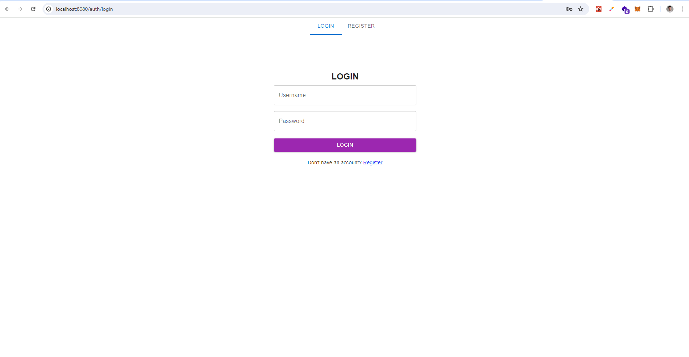
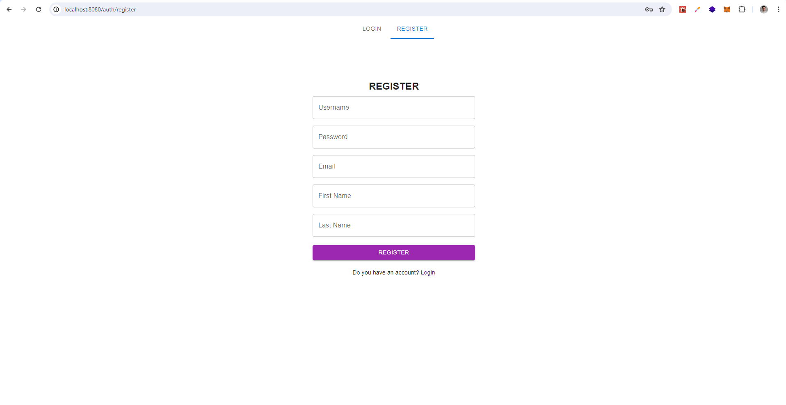
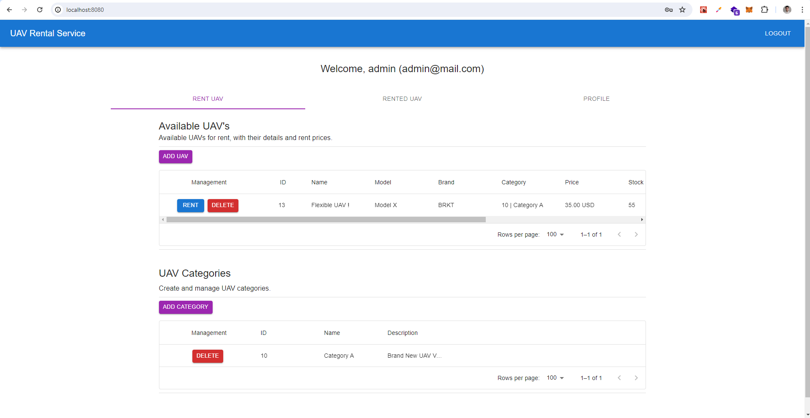
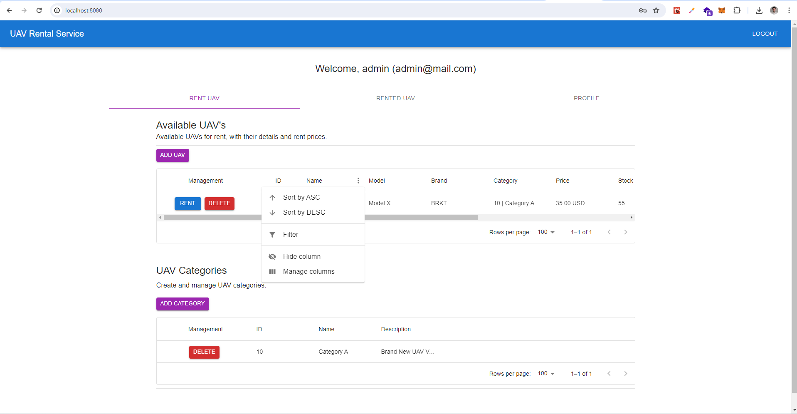
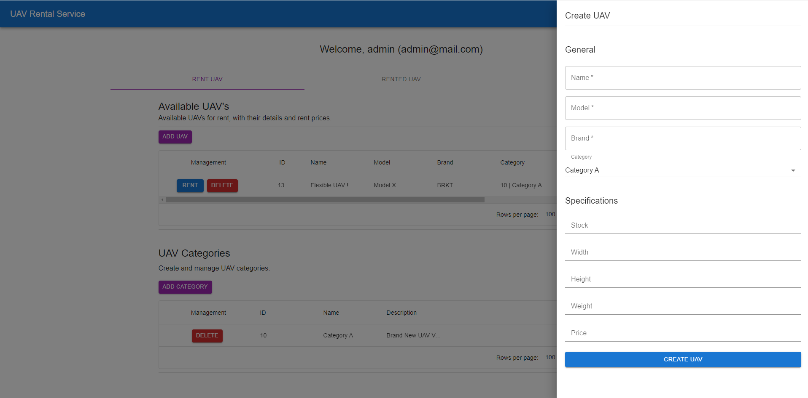
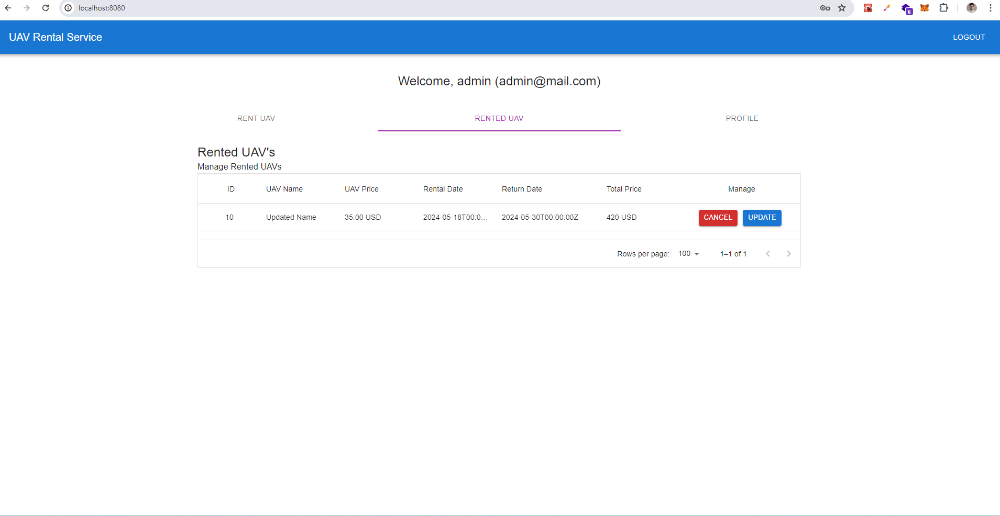
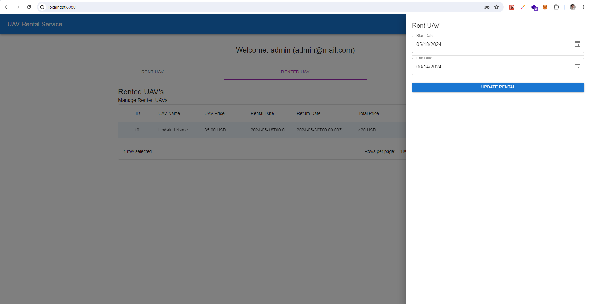
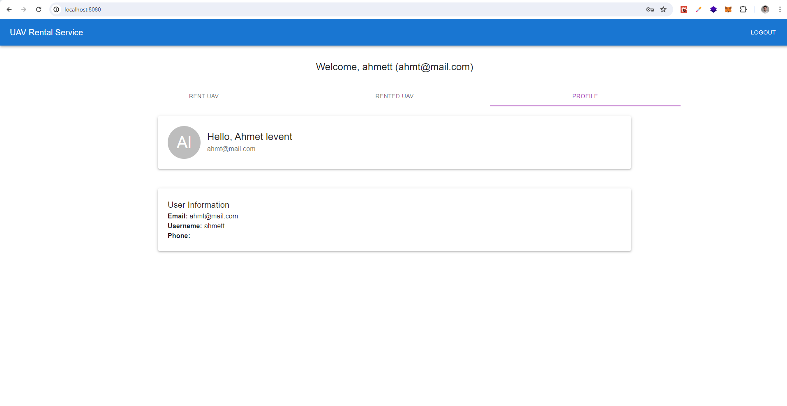

<!-- TOC start  -->

- [UAV Rental](#uav-rental)
   * [Tech Stack](#tech-stack)
   * [Features](#features)
   * [Running Tests](#running-tests)
   * [Local Installation](#local-installation)
      + [-  Database](#---database)
      + [- API ](#--api)
      + [- UI](#--ui)
   * [Docker Deployment](#docker-deployment)
      + [-  Build Images](#---build-images)
      + [-  Deploy](#---deploy)
   * [Screenshots](#screenshots)
      + [Login & Register](#login--register)
      + [UAVs Page](#uavs-page)
      + [Rented UAVs Page](#rented-uavs-page)
      + [Profile Page](#profile-page)

<!-- TOC end -->


# UAV Rental

This project aims to provide a platform for renting Unmanned Aerial Vehicles to individuals. 

## Tech Stack

**API:** Django, DjangoRestFramework, SimpleJWT

**UI:** React, MaterialUI, Vite.js, Router Dom, Redux Toolkit, Async Thunk

**Database:** PostgreSQL

**Docker:** Docker Compose

**Postman:** Quickstart with provided Postman Collection.

## Features

- User Membership
- JWT Authentication / Authorization
- UAV Management 
- UAV Category Management
- UAV Rental
## Running Tests

To run api tests, run the following command

```bash
  cd api
  python manage.py tests
```


## Local Installation

### -  Database
- Docker Engine & Docker Compose
```bash
  cd deployments
  docker compose up -d only-db.yml

```
    
### - API 
- Python 3.12
- Copy production.env and create .env file. Fill with local postgresql access informations.
```bash
  cd api
  pip install -r requirements.txt
  python manage.py migrate   # Make migrations
  python manage.py load_user # Load admin user that given in .env file.
  python manage.py test      # Run tests before application startup
  python manage.py runserver # Run application
  # ' Starting development server at http://127.0.0.1:8000/ '
```

### - UI
- Node.js v20.11.0

```bash
  cd ui
  npm install
  npm run dev

  # Go to Local url that vite.js logged. 
  - ➜  Local:   http://localhost:8080/
```

## Docker Deployment

### -  Build Images
```bash
  # Build API Image
  cd api
  docker image build -t api:0.1 .
  
  # Build UI Image
  cd ui
  docker image build -t ui:0.1
```
### -  Deploy
```bash
  # Deploy
  cd deployments
  docker compose -f full-stack-standalone.yml up -d 
```
## Screenshots

### Login & Register
- Login

- Register


### UAVs Page
- Members only can see "RENT" button.
- Only superusers can see 'ADD UAV' and "DELETE" buttons.
- Only superusers can view entire "UAV Categories" widget.

- All data tables can be sorted, filtered etc..

- Create UAV Drawer

- Superusers can double-click to data and update


### Rented UAVs Page
- Users can update and cancel rented UAVs.

- UAV update drawer.


### Profile Page
- Basic user informations

